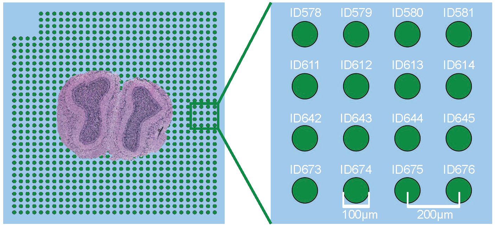
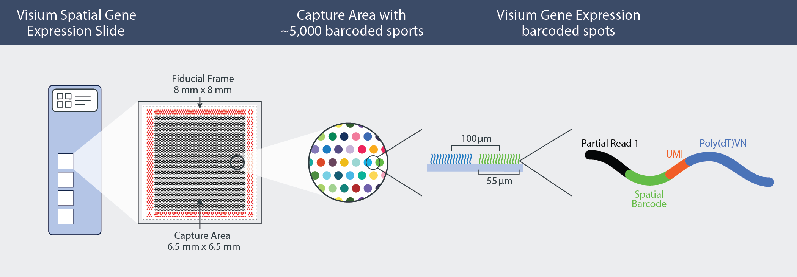

# Real data & analysis
This folder holds Notebooks of data preprocessing, analysis Notebooks and results of running SDePER on 4 real spatial transcriptomics datasets.

## Overview of 4 real spatial transcriptomics datasets and matched reference scRNA-seq datasets

|                                           | Mouse Olfactory Bulb (**MOB**)                               | **Melanoma**                                                 | Breast Cancer                                                | IPF Lung                                                     |
| ----------------------------------------- | ------------------------------------------------------------ | ------------------------------------------------------------ | ------------------------------------------------------------ | ------------------------------------------------------------ |
| Spatial transcriptomics data source paper | [Visualization and analysis of gene expression in tissue sections by spatial transcriptomics. 2016, *Science*](https://www.science.org/doi/10.1126/science.aaf2403) | [Spatially Resolved Transcriptomics Enables Dissection of Genetic Heterogeneity in Stage III Cutaneous Malignant Melanoma. 2018, *Cancer Research*](https://doi.org/10.1158/0008-5472.CAN-18-0747) | [Spatial deconvolution of HER2-positive breast cancer delineates tumor-associated cell type interactions. 2021, *Nature Communications*](https://doi.org/10.1038/s41467-021-26271-2) | [Our Paper](https://doi.org/10.1186/s13059-024-03416-2)      |
| Spatial transcriptomic technology         | Spatial Transcriptomics v1.0                                 | Spatial Transcriptomics v1.0                                 | Spatial Transcriptomics v1.0                                 | 10x Genomics Visium                                          |
| Reference scRNA-seq data source paper     | [Single-Cell RNA-Seq of Mouse Olfactory Bulb Reveals Cellular Heterogeneity and Activity-Dependent Molecular Census of Adult-Born Neurons. 2018, *Cell Reports*](https://doi.org/10.1016/j.celrep.2018.11.034) | [A Cancer Cell Program Promotes T Cell Exclusion and Resistance to Checkpoint Blockade. 2018, *Cell*](https://doi.org/10.1016/j.cell.2018.09.006) | [A single-cell and spatially resolved atlas of human breast cancers. 2021, *Nature Genetics*](https://doi.org/10.1038/s41588-021-00911-1) | [Single-cell RNA-seq reveals ectopic and aberrant lung-resident cell populations in idiopathic pulmonary fibrosis. 2020, *Science Advances*](https://doi.org/10.1126/sciadv.aba1983) |
| Reference scRNA-seq technology            | 10x Genomics Chromium Single Cell Gene Expression (droplet-based) | Smart-Seq2 (plate-based)                                     | 10x Genomics Chromium Single Cell Gene Expression (droplet-based) | 10x Genomics Chromium Single Cell Gene Expression (droplet-based) |
| Preprocess for cell type deconvolution    | [MOB_preprocess.nb.html](https://rawcdn.githack.com/az7jh2/SDePER_Analysis/0a429908645a665c1f9d345df013d5b9fcde20b3/RealData/MOB/MOB_preprocess.nb.html) | [Melanoma_preprocess.nb.html](https://rawcdn.githack.com/az7jh2/SDePER_Analysis/0a429908645a665c1f9d345df013d5b9fcde20b3/RealData/Melanoma/Melanoma_preprocess.nb.html) | [Breast_Cancer_preprocess.nb.html](https://rawcdn.githack.com/az7jh2/SDePER_Analysis/0a429908645a665c1f9d345df013d5b9fcde20b3/RealData/Breast_Cancer/Breast_Cancer_preprocess.nb.html) | [IPF_preprocess.nb.html](https://rawcdn.githack.com/az7jh2/SDePER_Analysis/c9b4698ecd9d0b1b0d2794df963127efe01ec231/RealData/IPF/IPF_preprocess.nb.html) |
| run SDePER on this real dataset           | [run_SDePER_on_MOB_data.ipynb](MOB/run_SDePER_on_MOB_data.ipynb) | [run_SDePER_on_Melanoma_data.ipynb](Melanoma/run_SDePER_on_Melanoma_data.ipynb) | [run_SDePER_on_Breast_Cancer_data.ipynb](Breast_Cancer/run_SDePER_on_Breast_Cancer_data.ipynb) | [run_SDePER_on_IPF_data.ipynb](IPF/run_SDePER_on_IPF_data.ipynb) |

## Spot size of spatial transcriptomic technologies in read data analysis

### Spatial Transcriptomics v1.0

The diameter of each spot is **100 µm** and the spot center to center distance is **200 µm**. Copied from Figure S2 in [Visualization and analysis of gene expression in tissue sections by spatial transcriptomics. 2016, *Science*](https://www.science.org/doi/10.1126/science.aaf2403).

### 10x Genomics Visium

The diameter of each spot is **55 µm** and the spot center to center distance is **100 µm**. Copied from Figure 1 in [Inside Visium spatial capture technology](https://pages.10xgenomics.com/rs/446-PBO-704/images/10x_BR060_Inside_Visium_Spatial_Technology.pdf).

